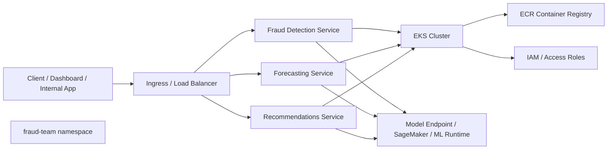
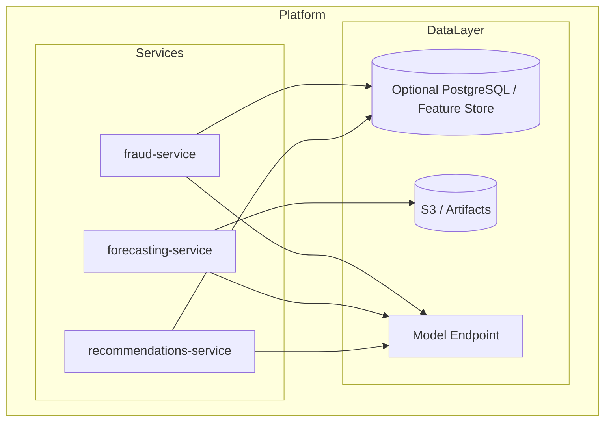

# Assessment IV ML Platform

This repository is a production-ready blueprint for an AWS-based machine learning platform running on Kubernetes. The system is designed around a set of independent microservices that expose prediction APIs, are deployed in Kubernetes, and integrate with AWS services such as ECR, EKS, IAM, and managed ML infrastructure.

## Architecture Overview

The platform follows a modular, service-oriented architecture:

- Client or internal application sends requests to the platform
- Ingress routes traffic to the appropriate service
- Each service is isolated in its own Kubernetes namespace and deployment
- Models are served as microservices and can later integrate with SageMaker or other ML runtimes
- AWS manages container registry, identity, and cluster infrastructure



## Service Layout



## Production-Ready Folder Structure

```text
assessment-iv-ml-platform/
├── README.md
├── .gitignore
├── .github/
│   └── workflows/
│       └── ci-cd.yml
├── apps/
│   ├── dashboard/
│   │   ├── frontend/
│   │   └── backend/
│   └── services/
│       ├── fraud/
│       │   ├── app/
│       │   ├── tests/
│       │   ├── Dockerfile
│       │   ├── requirements.txt
│       │   └── README.md
│       ├── forecasting/
│       │   ├── app/
│       │   ├── tests/
│       │   ├── Dockerfile
│       │   ├── requirements.txt
│       │   └── README.md
│       └── recommendations/
│           ├── app/
│           ├── tests/
│           ├── Dockerfile
│           ├── requirements.txt
│           └── README.md
├── terraform/
│   ├── modules/
│   │   ├── vpc/
│   │   │   ├── vpc.tf
│   │   │   └── variables.tf
│   │   ├── eks/
│   │   ├── ecr/
│   │   ├── iam/
│   │   └── observability/
│   └── environments/
│       ├── dev/
│       ├── staging/
│       └── prod/
├── k8s/
│   ├── namespaces/
│   ├── services/
│   ├── deployments/
│   ├── ingress/
│   ├── configmaps/
│   ├── secrets/
│   └── observability/
├── data/
│   ├── raw/
│   ├── processed/
│   └── schemas/
├── ml/
│   ├── training/
│   ├── notebooks/
│   ├── pipelines/
│   └── models/
├── docs/
│   ├── architecture/
│   ├── runbooks/
│   ├── api/
│   └── security/
├── scripts/
│   ├── build.sh
│   ├── deploy.sh
│   └── bootstrap.sh
└── monitoring/
    ├── dashboards/
    ├── alerts/
    └── logs/
```

## Production Goals

This platform should eventually support:

- secure AWS identity and access patterns
- isolated service deployments per namespace
- containerized ML services with health probes and readiness checks
- CI/CD for build, test, and deployment automation
- model serving integration with either SageMaker or a custom inference API
- observability through logs, metrics, and dashboards
- environment separation between dev, staging, and prod

## Planned Segment Work

The work should be split into the following segments:

1. Foundation and infrastructure
   - Terraform for VPC, EKS, ECR, IAM, and networking
   - cluster bootstrap and namespace setup

2. Application services
   - fraud detection API
   - forecasting API
   - recommendations API

3. Model and ML layer
   - feature engineering
   - training pipeline
   - model registry and deployment

4. Deployment and reliability
   - Kubernetes manifests
   - ingress and autoscaling
   - health checks and resilience patterns

5. Operations and observability
   - logs, metrics, traces
   - dashboards and alerts
   - runbooks and incident response

6. Security and governance
   - secrets management
   - least-privilege IAM
   - network policies and policy guardrails

## Manual Deployment Guide

Use the following steps to deploy the applications manually from this repository.

### 1. Configure AWS credentials

Make sure your AWS CLI is authenticated and the default region matches the Terraform configuration:

```bash
aws configure
aws sts get-caller-identity
export AWS_REGION=us-east-1
```

### 2. Create or validate the EKS cluster and node group

From the Terraform directory, initialize and apply the infrastructure:

```bash
cd terraform
terraform init
terraform plan
terraform apply
```

This creates the VPC, EKS cluster, node group, and ECR repositories for the assessment services.

### 3. Update kubeconfig for the cluster

After the cluster is created, connect your local kubectl to it:

```bash
aws eks update-kubeconfig --name anthony-assessment4-eks --region us-east-1
kubectl get nodes
```

### 4. Build Docker images locally

Build each service image from its app directory:

```bash
cd ../apps/services/forecasting
aws ecr get-login-password --region us-east-1 | docker login --username AWS --password-stdin 388691194728.dkr.ecr.us-east-1.amazonaws.com

docker build -t anthony-assessment4-forecasting:v1 .
docker tag anthony-assessment4-forecasting:v1 388691194728.dkr.ecr.us-east-1.amazonaws.com/anthony-assessment4-forecasting:v1
docker push 388691194728.dkr.ecr.us-east-1.amazonaws.com/anthony-assessment4-forecasting:v1

cd ../fraud
docker build -t anthony-assessment4-fraud:v1 .
docker tag anthony-assessment4-fraud:v1 388691194728.dkr.ecr.us-east-1.amazonaws.com/anthony-assessment4-fraud:v1
docker push 388691194728.dkr.ecr.us-east-1.amazonaws.com/anthony-assessment4-fraud:v1

cd ../recommendations
docker build -t anthony-assessment4-recommendations:v1 .
docker tag anthony-assessment4-recommendations:v1 388691194728.dkr.ecr.us-east-1.amazonaws.com/anthony-assessment4-recommendations:v1
docker push 388691194728.dkr.ecr.us-east-1.amazonaws.com/anthony-assessment4-recommendations:v1
```

### 5. Apply Kubernetes manifests

From the repo root:

```bash
kubectl apply -f k8s/namespaces/fraud-team.yaml
kubectl apply -f k8s/configmaps/
kubectl apply -f k8s/secrets/
kubectl apply -f k8s/deployments/
kubectl apply -f k8s/services/
kubectl apply -f k8s/ingress/ingress.yaml
```

### 6. Verify pods and services

```bash
kubectl get ns
kubectl get pods -n fraud-team
kubectl get svc -n fraud-team
kubectl get ingress -n fraud-team
```

### 7. Test endpoints locally

If you port-forward the service, you can test health endpoints directly:

```bash
kubectl port-forward -n fraud-team svc/fraud-service 8000:80
curl http://localhost:8000/health

kubectl port-forward -n fraud-team svc/forecasting-service 8001:80
curl http://localhost:8001/health

kubectl port-forward -n fraud-team svc/recommendations-service 8002:80
curl http://localhost:8002/health
```

### 8. Clean up

To remove the deployed resources:

```bash
kubectl delete -f k8s/
cd terraform
terraform destroy
```

## Recommended Next Steps

- Create the actual production folder layout under `apps/`, `infra/`, `ml/`, and `docs/`
- Move the current FastAPI service code into the `apps/services/*` structure
- Add terraform modules for AWS base infrastructure
- Define Kubernetes namespace and ingress YAMLs
- Add CI pipeline for build and deploy automation
- Document service contracts and deployment commands

## Notes

This repository is intentionally structured as a platform blueprint, not just a single app. The intent is to separate infrastructure, application services, model work, and operational concerns so the system can scale from proof-of-concept into a production deployment model.
