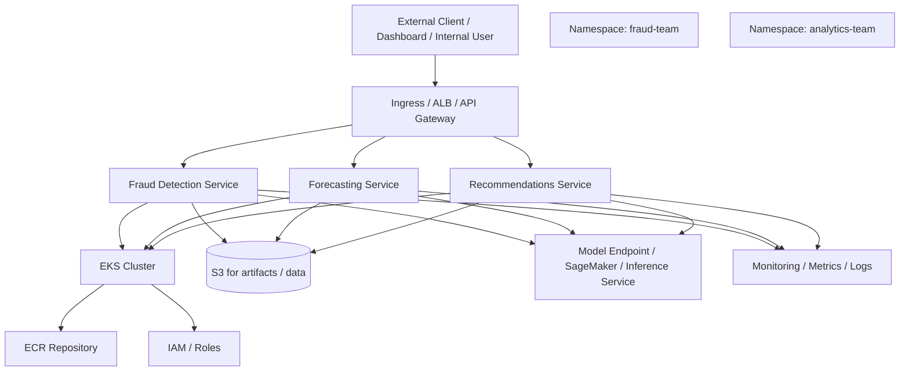
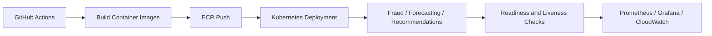
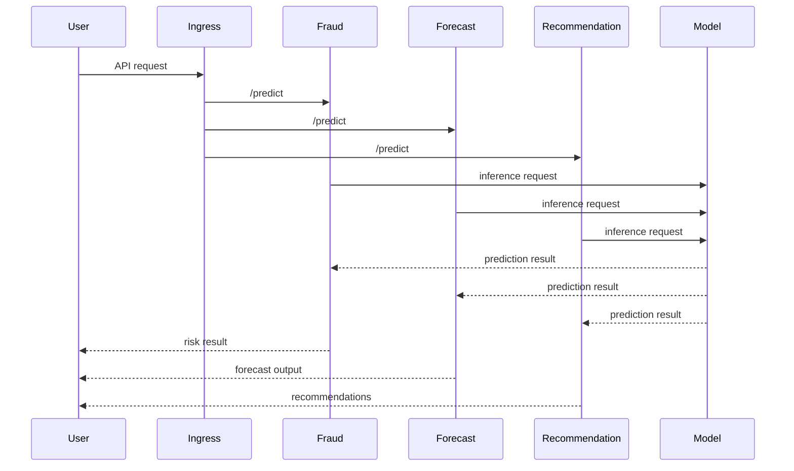

# Platform Architecture

## High-Level System Architecture

## Deployment Pattern

## Service Interaction Model

## Infrastructure Layer

This project should eventually include:

- AWS VPC with private/public subnets
- EKS control plane and worker nodes
- container registry in ECR
- Kubernetes namespaces per workload
- IAM policies and service accounts
- S3 and optional database storage for training and serving data
- ingress/load balancing for application access

## Application Layer

The app layer contains:

- fraud detection microservice
- forecasting microservice
- recommendations microservice
- optional dashboard or admin UI

Each service exposes:

- /health
- /ready
- /predict

## ML Layer

The ML layer can be implemented using:

- SageMaker endpoints
- custom model-serving containers
- feature stores and data pipelines
- model training scripts and registry metadata

## Operational Layer

Operational concerns include:

- CI/CD pipelines
- logging and dashboards
- autoscaling
- alerting
- incident response and runbooks
- infrastructure as code with Terraform
